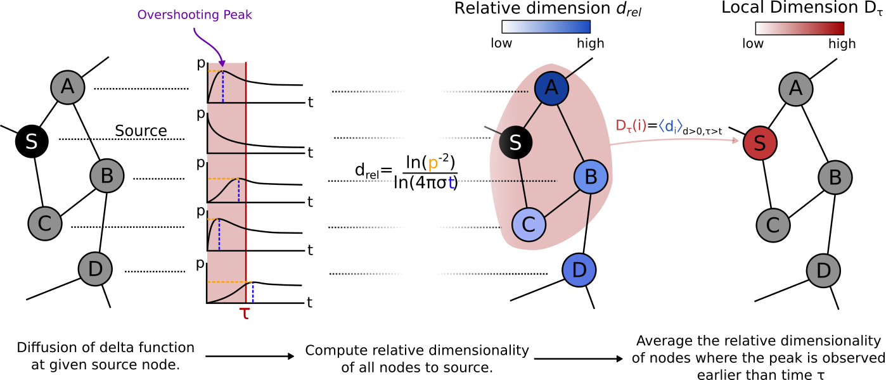

Dynamic Graph Dimension
=====================

Dynamic Graph Dimension (DynGDim) is a methodology for calculating the relative, local and global dimension of complex networks.

Dimension is a fundamental property of objects and the space in which they are embedded. Yet ideal notions of dimension, as in Euclidean spaces, do not always translate to physical spaces, which can be constrained by boundaries and distorted by inhomogeneities, or to intrinsically discrete systems such as networks. To take into account locality, finiteness and discreteness, dynamical processes can be used to probe the space geometry and define its dimension. Here we show that each point in space can be assigned a relative dimension with respect to the source of a diffusive process, a concept that provides a scale-dependent definition for local and global dimension also applicable to networks. To showcase its application to physical systems, we demonstrate that the local dimension of structural protein graphs correlates with structural flexibility, and the relative dimension with respect to the active site uncovers regions involved in allosteric communication. In simple models of epidemics on networks, the relative dimension is predictive of the spreading capability of nodes, and identifies scales at which the graph structure is predictive of infectivity.


The code in this repository implements the Relative Dimension algorithm and contains a small pipeline to run examples on classic graphs. 

<p align="center">
  
</p>


In the Figure above we can see a schematic of how relative dimension and local dimension are computed. The local dimension is parameterised by Markov time as a scaling parameter, whereby at short timescales we compute the dimension of the local environment around a node whilst at long timescales we compute the dimension of a node whilst considering the entire network structure.


For more information please see our arxiv [paper]().


## Cite

Please cite our paper if you use this code in your own work:

```

```

The bibtex code for citing our paper:

```

```

## Installation

To install:
```
pip install -e . 
```


## Tests

To run the code, see folder `examples`:
```
python run_single_source.py
python plot_single_source.py
```
For a quick start, check out our [examples](https://github.com/barahona-research-group/DynGDim/tree/master/examples) in the `examples/` directory.


## Our other available packages

If you are interested in trying our other packages, see the below list:
* [GDR](https://github.com/barahona-research-group/GDR) : Graph diffusion reclassification. A methodology for node classification using graph semi-supervised learning.
* [hcga](https://github.com/barahona-research-group/hcga) : Highly comparative graph analysis. A graph analysis toolbox that performs massive feature extraction from a set of graphs, and applies supervised classification methods.
* [MSC](https://github.com/barahona-research-group/MultiscaleCentrality) : MultiScale Centrality: A scale dependent metric of node centrality.
* [DynGDim](https://github.com/barahona-research-group/DynGDim) : Dynamic Graph Dimension: Computing the relative, local and global dimension of complex networks.
* [PyGenStability](https://github.com/barahona-research-group/PyGenStability) : Markov Stability: Computing the Markov Stability graph community detection algorithm in Python.
* [RMST](https://github.com/barahona-research-group/RMST) : Relaxed Minimum Spanning Tree: Computing the relaxed minimum spanning tree to sparsify networks whilst retaining dynamic structure.
* [StEP](https://github.com/barahona-research-group/StEP) :  Spatial-temporal Epidemiological Proximity: Characterising contact in disease outbreaks via a network model of spatial-temporal proximity.


